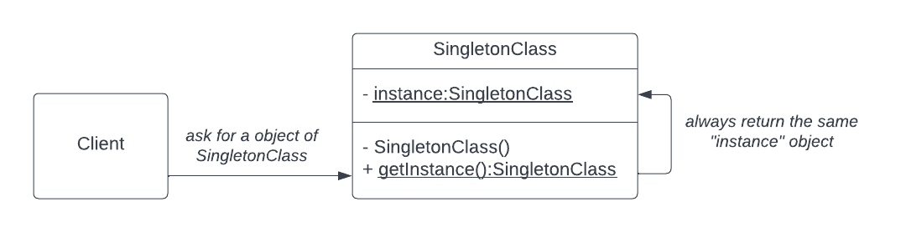

# java-design-patterns
The Gang-of-Four Design Patterns Implemented in Java

Check out my blog series about Design Patterns in Java at:
- [Design Pattern Series](https://pedrolopesdev.com/series/design-patterns/)

Summary:
- [Singleton Design Pattern](#singleton-design-pattern)

### [Singleton Design Pattern](https://pedrolopesdev.com/post/java-singleton-design-pattern-code-examples/)

#### Different Implementations
  - [Naive Lazy Initialization Singleton](./src/main/java/com/example/designpatterns/singleton/LazyInitSingleton.java) 
  - [Synchronized Lazy Initialization Singleton](./src/main/java/com/example/designpatterns/singleton/SynchronizedLazyInitSingleton.java) 
  - [Double-Checked Locking Lazy Initialization Singleton](./src/main/java/com/example/designpatterns/singleton/DoubleCheckedLockingSingleton.java) 
  - [Bill Pugh's Lazy Initialization Singleton](./src/main/java/com/example/designpatterns/singleton/BillPughSingleton.java)
  - [Eager Initialization Singleton](./src/main/java/com/example/designpatterns/singleton/EagerInitSingleton.java)
  - [Enum Eager Initialization Singleton](./src/main/java/com/example/designpatterns/singleton/EnumSingleton.java)

#### Resources

- [Singleton Design Pattern in Java: 6 Implementations with Code Examples](https://pedrolopesdev.com/post/java-singleton-design-pattern-code-examples/)

